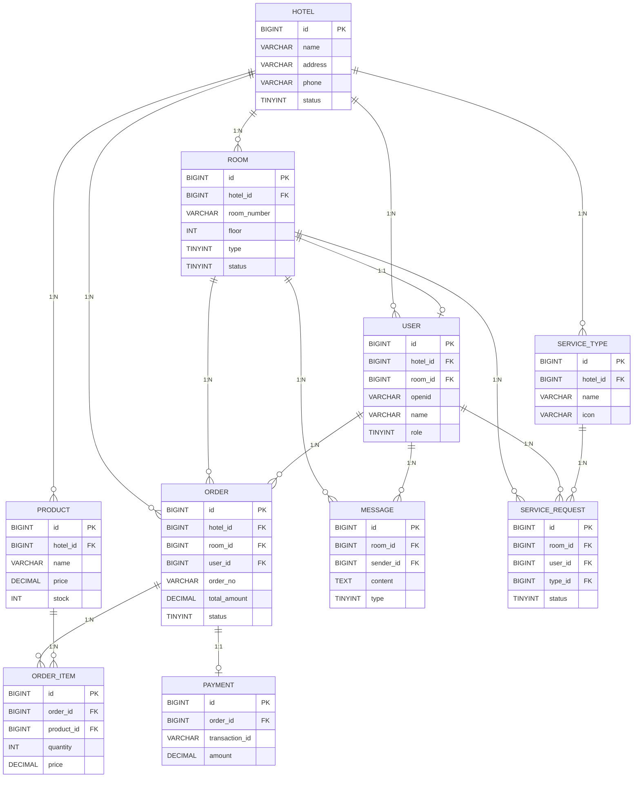

# 智慧酒店管家服务平台 - 数据库 ER 图

**版本**: V1.0  
**设计日期**: 2026-03-30  
**设计人**: AI 当前

---

## 📊 ER 关系图（Mermaid）



---

## 📋 表说明

| 表名 | 中文名 | 说明 | 数据量预估 |
|------|--------|------|-----------|
| hotel | 酒店表 | 连锁酒店管理 | 少（<100） |
| user | 用户表 | 客人、管家、管理员 | 中（10 万+） |
| room | 房间表 | 酒店房间信息 | 中（1 万+） |
| message | 消息表 | 聊天消息 | 海量（亿级） |
| product | 商品表 | 商城商品 | 少（<1000） |
| order | 订单表 | 购物订单 | 中（100 万+） |
| order_item | 订单明细表 | 订单商品明细 | 中（500 万+） |
| service_type | 服务类型表 | 服务分类 | 少（<50） |
| service_request | 服务请求表 | 客人服务请求 | 中（50 万+） |
| payment | 支付记录表 | 支付流水 | 中（100 万+） |

---

## 🔐 房间隔离设计

### 核心原则

```
┌─────────────────────────────────────────────────┐
│           房 间 隔 离 中 间 件                    │
├─────────────────────────────────────────────────┤
│ 1. 所有业务表必须包含 room_id 字段               │
│ 2. 所有查询必须带 room_id 条件                   │
│ 3. JWT Token 中携带 room_id                      │
│ 4. 中间件自动校验 room_id                        │
└─────────────────────────────────────────────────┘
```

### 查询示例

```sql
-- ❌ 错误：缺少 room_id 条件
SELECT * FROM message WHERE sender_id = 123;

-- ✅ 正确：带 room_id 条件
SELECT * FROM message 
WHERE room_id = 456 AND sender_id = 123;
```

---

## 📈 索引设计

### 核心索引

| 表名 | 索引名 | 字段 | 类型 | 说明 |
|------|--------|------|------|------|
| user | uk_openid | openid | UNIQUE | 微信 openid 唯一 |
| user | idx_hotel_room | hotel_id, room_id | NORMAL | 酒店 + 房间查询 |
| room | uk_hotel_room | hotel_id, room_number | UNIQUE | 酒店房间号唯一 |
| message | idx_room_created | room_id, created_at | NORMAL | 房间消息列表 |
| order | uk_order_no | order_no | UNIQUE | 订单号唯一 |
| order | idx_room_status | room_id, status | NORMAL | 房间订单查询 |

---

*ER 图版本：V1.0*  
*最后更新：2026-03-30*  
*协作人：Ray（后端）待评审*
